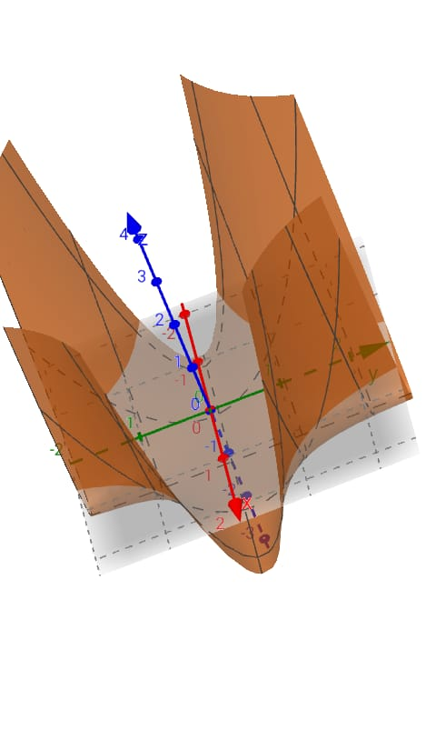

# 🧠 Synap – Estudos de Redes Neurais em C++

---

## 📌 Sobre

Este repositório é apenas um **registro dos meus estudos pessoais** em redes neurais.  
Aqui eu exploro como redes neurais funcionam internamente, escrevendo tudo do zero em C++ sem bibliotecas externas.  

📖 **Objetivo:** entender profundamente:
- Ajuste de pesos e bias
- Gradiente descendente aplicado manualmente
- Diferença entre funções lineares e não lineares
- Como equações matemáticas moldam o comportamento da rede

---

## ✍️ Fórmula do Modelo

O modelo que treinei possui:

- **2 pesos:** `w1`, `w2`  
- **1 viés (bias):** `b`  

📌 **Total de parâmetros:** 3 (2 pesos + 1 bias)

Esse formato gera uma superfície **não linear** (parecida com um pano curvado em 3D), permitindo melhor ajuste dos dados.

---

## 🎥 Vídeos Relacionados

🔹 **Rodando e testando o modelo:**  

🔹 **Visualização da fórmula e variações nos parâmetros:**  

---

## 🧠 Conceitos Estudados

### 🔹 Funções Lineares vs Não Lineares
- **Linear:** saída é uma reta ou plano  
  \[
  y = w \cdot x + b
  \]
- **Não Linear:** presença de termos quadráticos, exponenciais, etc.  
  \[
  y = (x \cdot z)^2
  \]
- O modelo é **não linear**, conseguindo capturar relações mais complexas.

### 🔹 Função de Erro (Loss)
- Medida do quanto a previsão está distante do valor real.
- Quanto mais próximo de **0**, melhor está o modelo.
- Aqui uso **erro quadrático médio**.

### 🔹 Gradiente Descendente
- Método para encontrar os melhores pesos ajustando-os gradualmente.
- Calcula-se a derivada da loss em relação a cada parâmetro e atualiza:
\[
w \gets w - \eta \frac{\partial \text{Loss}}{\partial w}
\]
onde `η` é a **taxa de aprendizado**.

### 🔹 Atualização de Pesos e Bias
- Cada época do treino recalcula gradientes
- Ajusta `w1`, `w2` e `b` até que a loss esteja muito baixa
- Esse processo "ensina" o modelo a se aproximar da função original

---

## ⚖️ Licença

Open Source – você pode usar e modificar, mas **deixe os créditos**.

---

📌 **Nota:** Este repositório não é um framework ou projeto de produção. É apenas parte da minha jornada aprendendo redes neurais na prática, escrevendo código e entendendo os fundamentos.